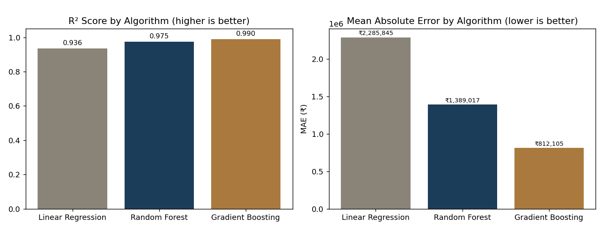
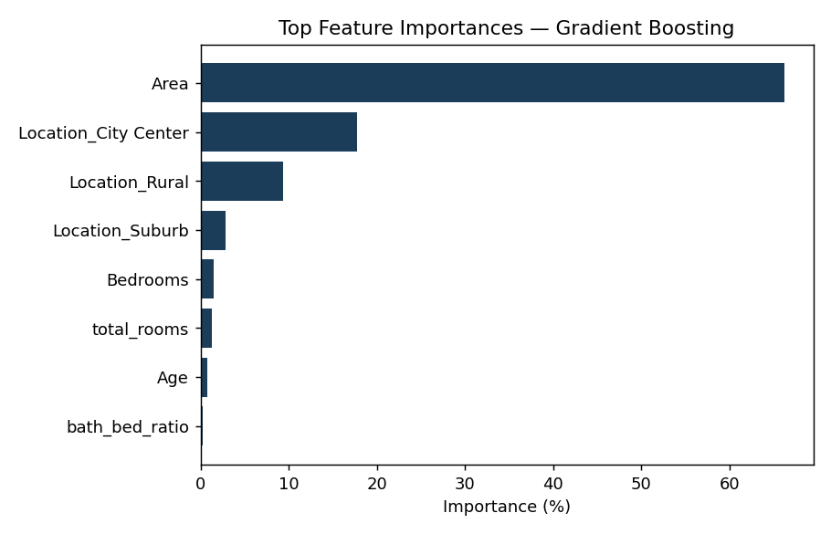

# Property Valuation Desk — House Price Prediction

An end-to-end machine learning system that predicts residential property
prices in INR from property characteristics (area, rooms, age, location,
and type), served through a web interface and a JSON API.

Built as a complete pipeline: data cleaning → feature engineering → model
training & comparison → evaluation → interpretation → web deployment.


## Business problem

A real-estate platform wants an automated price estimate for a listing
based on its basic attributes, so buyers and sellers get an instant,
data-driven reference price instead of relying purely on manual appraisal.

## Quick start

```bash
git clone <this-repo>
cd house-price-ml
pip install -r requirements.txt

# Train the model (reads data/house_prices.csv, writes models/house_price_model.pkl)
python3 src/model_training.py

# Run the test suite
python3 -m pytest tests/ -v

# Start the web app
python3 app/web_app.py
# -> open http://localhost:5000
```

Or run all of the above in one go:

```bash
./scripts/setup_and_run.sh
```

## Project structure

```
house-price-ml/
├── data/
│   ├── house_prices.csv          # 300-row sample dataset
│   └── DATA_DICTIONARY.md        # column definitions & engineered features
├── notebooks/
│   ├── 01_exploratory_analysis.ipynb
│   └── 02_model_training_evaluation.ipynb
├── src/
│   ├── data_preprocessing.py     # cleaning + feature engineering
│   ├── model_training.py         # trains/compares 3 algorithms, persists best
│   └── model_inference.py        # validated prediction wrapper used by the app
├── app/
│   ├── web_app.py                # Flask app: HTML form + JSON API
│   ├── templates/index.html
│   └── static/
├── models/
│   └── house_price_model.pkl     # persisted best pipeline (created by training)
├── tests/
│   ├── test_data_preprocessing.py
│   ├── test_model_inference.py
│   └── test_web_app.py
├── config/
│   └── config.yaml
├── scripts/
│   └── setup_and_run.sh
├── docs/
│   ├── model_performance.json    # metrics for all 3 algorithms
│   ├── model_comparison.png
│   ├── feature_importance.png
│   └── screenshots/
├── requirements.txt
└── README.md
```

## Methodology

1. **Data preprocessing** (`src/data_preprocessing.py`): loads the raw CSV,
   drops duplicates, coerces types, removes physically impossible values
   (e.g. non-positive area/price), imputes any missing numerics with the
   median, and drops rows with unrecognised categories.
2. **Feature engineering**: adds `total_rooms`, `bath_bed_ratio`, `is_new`,
   `area_per_room`, and a binned `age_bucket` on top of the raw columns
   (see the data dictionary for rationale).
3. **Model training** (`src/model_training.py`): builds a
   `ColumnTransformer` (standard-scaled numerics + one-hot-encoded
   categoricals) feeding into three candidate regressors, each tuned with
   `GridSearchCV` and 5-fold cross-validation:
   - Linear Regression (baseline)
   - Random Forest Regressor
   - Gradient Boosting Regressor
4. **Evaluation**: each model is scored on a held-out 20% test set with
   MAE, RMSE, R², and MAPE, plus cross-validated R² for stability. The
   best model by test R² is persisted with `pickle`, versioned, and
   time-stamped.
5. **Interpretation**: feature importances (or |coefficients| for the
   linear model) are extracted, normalised to percentages, and saved to
   `docs/model_performance.json` and `docs/feature_importance.png`.
6. **Deployment**: `src/model_inference.py` wraps the persisted pipeline
   with input validation; `app/web_app.py` exposes it via an HTML form and
   a `/api/predict` JSON endpoint, with error handling throughout.

## Model performance

| Algorithm | MAE (₹) | RMSE (₹) | R² | MAPE | CV R² (mean ± std) |
|---|---:|---:|---:|---:|---|
| Linear Regression | 2,285,845 | 3,020,306 | 0.936 | 13.9% | 0.954 ± 0.007 |
| Random Forest | 1,389,017 | 1,890,175 | 0.975 | 6.3% | 0.971 ± 0.005 |
| **Gradient Boosting (selected)** | **812,105** | **1,199,574** | **0.990** | **3.9%** | **0.989 ± 0.003** |



Gradient Boosting was selected as the production model: lowest error on
the held-out test set, and the tightest, most stable cross-validation
score of the three (see `docs/model_performance.json` for full numbers).

### Feature importance



`Area` accounts for roughly two-thirds of the model's predictive signal,
with `Location` (especially City Center) as the second major driver.
Room counts, age, and property type contribute comparatively little.

### Business insights

- **Square footage is the strongest price driver** — accurate area
  measurement matters more than any other single data point for pricing
  accuracy.
- **Location carries a real premium**: City Center properties are priced
  meaningfully higher than Suburb or Rural properties at the same size.
- **Bedrooms/bathrooms and age matter, but secondarily** — they refine an
  estimate more than they drive it.
- Given the strong Area relationship, sanity-checking listed square
  footage would likely do more for pricing accuracy than adding new
  amenity features.

## API documentation

### `GET /api/health`

Returns model status and current metrics.

```json
{
  "status": "healthy",
  "model_name": "gradient_boosting",
  "model_version": "1.0.0",
  "metrics": {"mae": 812104.6, "rmse": 1199574.0, "r2": 0.99, "mape": 3.94, ...}
}
```

### `POST /api/predict`

Request body (JSON):

```json
{
  "area": 1200,
  "bedrooms": 3,
  "bathrooms": 2,
  "age": 5,
  "location": "City Center",
  "property_type": "Apartment"
}
```

Success response (`200`):

```json
{
  "success": true,
  "data": {
    "prediction": 18555903.44,
    "confidence_interval_low": 17743798.83,
    "confidence_interval_high": 19368008.06,
    "model_used": "gradient_boosting",
    "model_version": "1.0.0"
  }
}
```

Validation error response (`400`):

```json
{"success": false, "error": "Area must be a positive number (up to 100,000 sqft)."}
```

`location` must be one of `City Center`, `Suburb`, `Rural`.
`property_type` must be one of `House`, `Apartment`, `Villa`.
The confidence interval is the point prediction ± the model's test-set MAE,
a simple and transparent (if approximate) uncertainty estimate.

## Web interface

`GET /` serves an HTML form; submitting it (`POST /predict`) renders the
estimate on the same page. See `docs/screenshots/` for the empty and
filled-in states.

## Testing

26 tests across three suites, run with `pytest tests/ -v`:

- `test_data_preprocessing.py` — schema validation, cleaning rules
  (duplicates, impossible values, unrecognised categories, imputation),
  and feature engineering correctness.
- `test_model_inference.py` — input validation (missing fields, bad
  ranges, invalid categories, non-numeric input) and prediction sanity
  checks (positive price, valid confidence interval, monotonicity with
  area).
- `test_web_app.py` — route availability, health check, JSON API success
  and error paths, and HTML form success and error paths.

## Error handling & input validation

- `data_preprocessing.py` raises `DataValidationError` on missing
  required columns before any transformation runs.
- `model_inference.py` raises `InputValidationError` for missing fields,
  non-numeric values, out-of-range numbers, or unrecognised categories,
  with a specific message for each case.
- `web_app.py` catches `InputValidationError` and renders/returns a clear
  400 error (form or JSON) rather than crashing, and falls back to a
  generic 500 with logging for any unexpected exception.

## Troubleshooting

| Symptom | Likely cause | Fix |
|---|---|---|
| `FileNotFoundError: No trained model found` | `model_training.py` hasn't been run yet | `python3 src/model_training.py` |
| Web app shows "Model not loaded on server" | Training failed or `models/house_price_model.pkl` missing | Check training logs, retrain |
| `/api/predict` returns 400 for valid-looking input | `location`/`property_type` value doesn't match the exact allowed strings (case/spacing) | Use exactly `City Center`, `Suburb`, `Rural`, `House`, `Apartment`, or `Villa` |
| Tests skip with "Trained model not found" | Same as above | Train the model first, then re-run `pytest` |
| `pip install` fails on a pinned version | Local Python version mismatch | Loosen version pins in `requirements.txt` or use a virtualenv matching Python 3.10+ |

## Model persistence & versioning

The trained pipeline is saved as a single pickle bundle containing the
fitted `sklearn` `Pipeline`, the model name, feature lists, evaluation
metrics, a semantic `version` string, and a training timestamp — so the
serving code never has to guess what shape of input the model expects.
Bump `version` in `src/model_training.py`'s save block when retraining
with a materially different pipeline or feature set.
