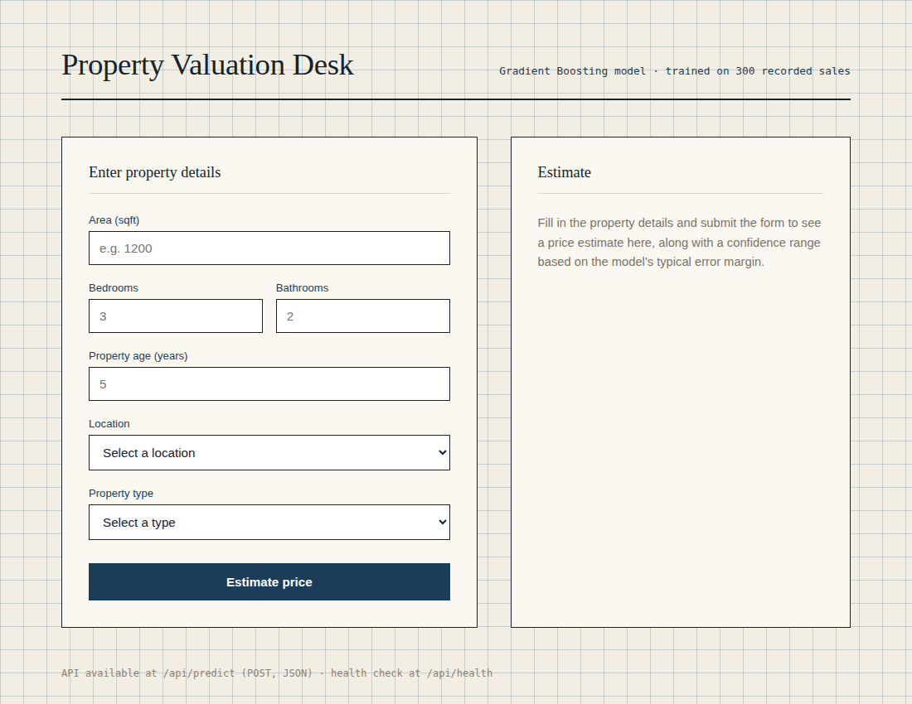
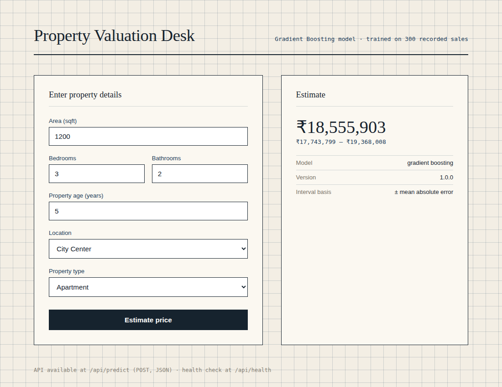

# Project Documentation — House Price Prediction

## 1. Project overview and objectives

**Goal:** predict a residential property's sale price (INR) from six
attributes — area, bedrooms, bathrooms, age, location, property type — and
serve that prediction through a web interface and a JSON API, following a
production-style ML workflow rather than a one-off notebook.

**Objectives met:**

- Complete, reusable preprocessing pipeline with feature engineering
- Three algorithms trained and compared under identical conditions
- Multi-metric evaluation with cross-validation
- Feature importance analysis with business interpretation
- A working web interface and JSON API
- Model persistence with versioning
- Input validation and error handling throughout
- Modular, testable code structure (26 automated tests)

## 2. Business problem statement

Manual property appraisal is slow and inconsistent. An automated estimate
based on comparable historical sales gives buyers, sellers, and agents an
instant reference point. The target metric that matters most to the
business is **MAPE (mean absolute percentage error)**, since a ₹1M error
on a ₹5M home is far more damaging than the same absolute error on a
₹50M home — the selected model achieves **3.94% MAPE**.

## 3. Data dictionary

See [`data/DATA_DICTIONARY.md`](../data/DATA_DICTIONARY.md) for the full
column-by-column reference, including engineered features.

## 4. Methodology

### 4.1 Preprocessing (`src/data_preprocessing.py`)

1. Load CSV, validate required columns exist.
2. Drop exact duplicate rows.
3. Coerce numeric columns; invalid values become `NaN`.
4. Impute missing numerics with the column median (done *before* the
   impossible-value filter, so a legitimately missing cell is repaired
   rather than discarded).
5. Drop rows with physically impossible values (non-positive area/price,
   age outside `[0, 150]`).
6. Drop rows whose `Location`/`Property_Type` isn't one of the known
   categories, rather than silently guessing.

### 4.2 Feature engineering

Five engineered features are added on top of the six raw predictors
(`total_rooms`, `bath_bed_ratio`, `is_new`, `area_per_room`,
`age_bucket`) — see the data dictionary for definitions and rationale.
None of them use `Price`, so there is no target leakage.

### 4.3 Modeling (`src/model_training.py`)

- A `ColumnTransformer` standard-scales the 8 numeric features and
  one-hot-encodes the 3 categorical features.
- Three regressors are each wrapped in this same preprocessing pipeline
  and tuned via `GridSearchCV` (5-fold `KFold`, scoring =
  `neg_mean_absolute_error`):
  - `LinearRegression` — no hyperparameters, used as an interpretable
    baseline.
  - `RandomForestRegressor` — grid over `n_estimators`, `max_depth`,
    `min_samples_leaf`.
  - `GradientBoostingRegressor` — grid over `n_estimators`,
    `learning_rate`, `max_depth`.
- An 80/20 train/test split (`random_state=42`) is held out from all
  tuning; final metrics are computed only on the untouched test set.
- Cross-validated R² on the training fold is also reported, to check
  that the test-set result isn't a lucky split.

### 4.4 Evaluation

Metrics computed per model: MAE, RMSE, R², MAPE, and cross-validated R²
(mean ± std). Full numbers are in
[`docs/model_performance.json`](model_performance.json) and summarised
in the main [README](../README.md#model-performance).

### 4.5 Interpretation

Feature importances are extracted from the winning model's `regressor`
step (`feature_importances_` for tree models, `|coef_|` for linear
regression), normalised to sum to 100%, and saved alongside the metrics.

### 4.6 Deployment

`src/model_inference.py` provides a `HousePriceModel` class that loads
the persisted pipeline once and exposes a single validated `predict()`
method. `app/web_app.py` is a thin Flask layer over that class with an
HTML form and a JSON API, so the model logic has exactly one
implementation shared by both surfaces.

## 5. Setup and installation

```bash
pip install -r requirements.txt
python3 src/model_training.py     # trains and saves models/house_price_model.pkl
python3 -m pytest tests/ -v       # optional: verify everything works
python3 app/web_app.py            # serves http://localhost:5000
```

No external services, API keys, or databases are required — everything
runs from the local CSV and a single pickle file.

## 6. Code structure

See the tree in the main [README](../README.md#project-structure). Each
`src/` module has a single responsibility (data prep, training,
inference) and no module imports Flask, keeping the ML logic reusable
outside a web context (e.g. from the notebooks or a future batch job).

## 7. Model performance analysis

See [README § Model performance](../README.md#model-performance) and
[`docs/model_performance.json`](model_performance.json) for full
per-algorithm metrics, and
[`notebooks/02_model_training_evaluation.ipynb`](../notebooks/02_model_training_evaluation.ipynb)
for the narrated walkthrough.

## 8. Feature importance interpretation

See [README § Feature importance](../README.md#feature-importance) and
[`docs/feature_importance.png`](feature_importance.png). In short: Area
(~66%) and Location (~30% combined across its three categories) account
for nearly all of the model's predictive power; everything else is
fine-tuning.

## 9. Deployment guide

- **Local:** `python3 app/web_app.py` runs Flask's development server on
  port 5000. This is fine for demoing but not for production traffic —
  the app explicitly warns about this (Flask's own runtime warning).
- **Production:** put a WSGI server in front of `app.web_app:app`, e.g.
  `gunicorn -w 2 -b 0.0.0.0:8000 app.web_app:app`, ideally behind a
  reverse proxy (nginx) for TLS and static-file serving.
- **Model updates:** re-run `python3 src/model_training.py` whenever
  `data/house_prices.csv` is refreshed; it overwrites
  `models/house_price_model.pkl` atomically and bumps the timestamp
  inside the bundle. Restart the app process to pick up the new file
  (it's loaded once at startup, not per-request).

## 10. API documentation

See [README § API documentation](../README.md#api-documentation) for
full request/response examples for `/api/health` and `/api/predict`.

## 11. Troubleshooting guide

See [README § Troubleshooting](../README.md#troubleshooting) for the
common-issues table (missing model file, validation errors, dependency
mismatches, etc).

## 12. Testing evidence

`pytest tests/ -v` → **26 passed**. Coverage spans:
- Data validation and cleaning edge cases (duplicates, impossible
  values, unknown categories, missing-value imputation ordering).
- Feature engineering correctness, including zero-bedroom edge cases.
- Inference input validation (every rejected-input path has a test).
- Flask routes: page load, health check, JSON API success/error paths,
  HTML form success/error paths.

## 13. Screenshots

| Empty form | Filled-in result |
|---|---|
|  |  |
